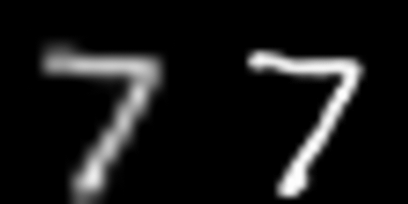
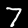

# Implementation-for-Super-Resolution
This is the Partial Implementation of Residual Dense Network Mentioned in the Paper [Residual Dense Network for Image Super-Resolution](https://arxiv.org/abs/1802.08797)

- Mnist data set is used as the training and testing dataset
- Model defined is simple as compared to as in the paper

> The 28 x 28 x 1 images were downscaled to 14 x 14 x1 for generating training and testing dataset

- The image to the left is 14 x 14 x 1 image
- The image to the right is 28 x 28 x1 image which is upscaled using Residual Dense Network

* Note : To display gif on git , Images has been rescaled to both 400 x 400 without any alternative resizing optimizations
* The Residual Dense Network is used to generate 28 x 28 x1 images from 14 x 14 x 1 images and, these are then upscaled to 400 x 400 x 1 without using any alternative resizing algorithms

* [Platform used to resize gifs](https://ezgif.com/resize)
* One can use the hrimages.gif and lrimages.gif to compare the gifs produced by the code,to observe differences
* low resolution images

* High resolution images

